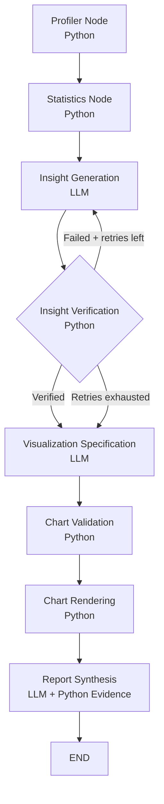

# AI Data Analyst Agent

An **Agentic AI data analysis system** built with **LangGraph** that autonomously analyzes CSV and Excel datasets, generates data-backed insights, validates every numeric claim deterministically, creates validated visualizations, and produces a final Markdown report.

The project combines **LLM reasoning with deterministic Python computation** to reduce hallucinations and prevent the model from validating its own claims.

> **The LLM reasons and writes. Python calculates and verifies.**
>
> The LLM never calculates a statistic and never decides whether its own claim is correct. Every numeric claim is independently checked against statistics computed directly from the dataset before it is included in the final report.

---

## Why This Is an Agentic AI System

This project is more than a traditional LLM wrapper or chatbot.

The workflow is orchestrated as a **stateful LangGraph agent** that:

* analyzes the dataset automatically
* decides which statistical analyses are relevant
* generates structured insights
* verifies those insights against deterministic statistics
* retries failed insights with verification feedback
* generates visualization specifications
* validates those specifications before rendering
* renders charts using Python
* synthesizes a final report
* handles failures and falls back safely when necessary

The agent therefore follows a **multi-step reasoning → validation → action → retry workflow** rather than simply sending a prompt to an LLM and returning its response.

---

## Key Features

* Upload CSV or Excel datasets without dataset-specific code
* Automatic dataset profiling and column-type classification
* Deterministic statistical analysis using Pandas and NumPy
* LLM-generated structured insights
* **Deterministic evidence verification for every numeric claim**
* Bounded self-critique and retry loop for failed insights
* LLM-generated visualization specifications
* Deterministic chart-spec validation before rendering
* Defensive re-validation immediately before chart rendering
* Automatic fallback charts when visualization generation fails
* Python-generated Statistical Evidence table
* Dataset validation and data-quality checks
* Protection against prompt injection through dataset values
* Structured logging and node execution timing
* Bounded LLM retries and timeouts
* Streamlit interface
* Fully mocked automated test suite requiring no API key

---

# Architecture



### Node Responsibilities

| Node                        | LLM?         | Responsibility                                                                 |
| --------------------------- | ------------ | ------------------------------------------------------------------------------ |
| `profiler_node`             | No           | Dataset shape, dtypes, nulls, cardinality, IDs, text, PII and target detection |
| `stats_node`                | No           | Deterministic statistical analysis based on column types                       |
| `insight_generation_node`   | Yes          | Generates structured, data-backed insights                                     |
| `insight_verification_node` | **No**       | Deterministically verifies every insight against computed statistics           |
| `visualization_spec_node`   | Yes          | Proposes relevant charts                                                       |
| `chart_rendering_node`      | No           | Validates and renders charts using Matplotlib/Seaborn                          |
| `report_synthesis_node`     | Yes + Python | Generates the narrative and appends verified evidence                          |

Only **3 of the 7 nodes directly call an LLM**.

The verification layer intentionally contains **no LLM call**.

---

# Agent Workflow

### 1. Dataset Ingestion

CSV or Excel files are loaded through the defensive file-loading and validation layer.

The system checks for:

* corrupted files
* duplicate columns
* all-null columns
* infinite values
* oversized files
* excessive row counts
* invalid or unsupported input

---

### 2. Dataset Profiling

The profiler automatically classifies columns as:

* continuous
* categorical
* datetime
* ID
* text
* all-null

It also detects likely:

* target variables
* PII columns
* identifier columns
* datetime columns

---

### 3. Deterministic Statistical Analysis

The statistics node uses Python rather than the LLM to calculate the actual numbers.

The analyses are selected automatically based on column types.

| Column Combination        | Analysis                                                  |
| ------------------------- | --------------------------------------------------------- |
| Numeric + Numeric         | Correlation                                               |
| Categorical + Numeric     | Group means                                               |
| Categorical + Categorical | Frequency / value counts                                  |
| Datetime + Numeric        | Monthly trends                                            |
| Single Numeric            | Mean, median, std, min, max, skew, kurtosis, IQR outliers |
| Single Categorical        | Value counts and cardinality                              |

The LLM never calculates these statistics.

---

# 4. Structured Insight Generation

Instead of asking the LLM to produce unrestricted analytical prose, the agent requires each insight to contain a structured statistic reference.

For example:

```python
class InsightItem(BaseModel):
    claim: str
    interpretation: str | None
    recommendation: str | None
    statistic: StatisticType
    source_column: str
    comparison_column: str | None
    category_value: str | None
    claimed_value: float
```

This allows Python to determine exactly which computed statistic the LLM is referring to.

---

# 5. Deterministic Evidence Verification

This is the core reliability mechanism of the project.

The system does **not** use a second LLM to fact-check the first LLM.

Instead:

```text
LLM-generated claim
        ↓
Structured statistic reference
        ↓
Python dictionary lookup
        ↓
Actual computed statistic
        ↓
Numeric comparison
        ↓
PASS / FAIL
```

The verification module directly looks up the claimed statistic from the statistics generated by Python.

For example:

```text
Claimed value: 9999.99
Actual value:     65.135
Result:            FAIL
```

The claim is therefore not allowed to silently pass into the verified evidence set.

A correctly rounded claim can pass within the configured tolerance.

Current verification uses:

* **2% relative tolerance**
* **0.01 absolute tolerance floor**

---

# 6. Self-Critique Retry Loop

When an insight fails verification, the agent does not simply accept it.

The verification result provides feedback such as:

```text
Claimed 9999.99 but the actual computed mean is 65.135.
```

That feedback is returned to the insight-generation node.

The LLM is then asked to generate a different verifiable insight.

The retry loop is bounded to prevent infinite execution.

```text
Insight Generation
       ↓
Verification
       ↓
   ┌── PASS ───────────────→ Continue
   │
 FAIL
   ↓
Retries remaining?
   │
   ├── YES → Generate again
   │
   └── NO  → Continue safely with failed evidence recorded
```

This gives the agent both **self-correction** and **termination guarantees**.

---

# 7. Visualization Planning

The LLM proposes visualization specifications rather than directly generating charts.

Every proposed chart is checked by:

```text
utils/chart_validation.py
```

The validation layer verifies:

* chart type
* column existence
* column count
* column data type
* compatibility between columns and chart type
* presence of usable non-null values

For example:

| Chart               | Requirements                              |
| ------------------- | ----------------------------------------- |
| Histogram           | Exactly 1 continuous column               |
| Box plot            | Exactly 1 continuous column               |
| Scatter             | Exactly 2 continuous columns              |
| Bar                 | 1 categorical or categorical + continuous |
| Line                | Datetime/categorical + continuous         |
| Correlation Heatmap | ≥2 continuous columns                     |

A hallucinated column such as:

```text
"revenue_growth"
```

when that column does not exist in the dataset is rejected before rendering.

---

# 8. Defensive Chart Rendering

The chart-rendering node validates every chart specification **again** immediately before rendering.

This provides a second safety boundary.

Each chart is rendered independently inside its own error-handling block.

Therefore:

```text
Bad Chart
   ↓
Rejected / skipped
   ↓
Other charts continue rendering
```

If the LLM generates invalid chart specifications, the system can fall back to deterministic charts rather than crashing the entire pipeline.

---

# 9. Report Synthesis

The final report combines:

### LLM-generated content

* analytical narrative
* interpretation
* recommendations
* explanation of important patterns

### Python-generated content

* Statistical Evidence table
* verification status
* actual computed values
* chart outputs

The evidence table is generated from Python verification results rather than trusting the LLM's final response.

---

# Reliability Architecture

The central design principle is:

```text
                 ┌──────────────────┐
                 │       LLM        │
                 │ Reason + Generate│
                 └────────┬─────────┘
                          │
                          ▼
                 Structured Output
                          │
                          ▼
              ┌──────────────────────┐
              │   Python Validation  │
              └──────────┬───────────┘
                         │
              ┌──────────┴──────────┐
              ▼                     ▼
            PASS                   FAIL
              │                     │
              ▼                     ▼
          Continue              Retry / Flag
```

The LLM is therefore **not the source of truth**.

The dataset and deterministic Python computations are the source of truth.

---

# Security / Prompt-Injection Consideration

Dataset content is treated as **untrusted data**.

Values contained inside uploaded datasets are explicitly separated from system instructions in the LLM context.

The model is instructed to treat dataset values as data rather than instructions.

This helps reduce the risk of prompt injection through malicious CSV/Excel cell contents.

---

# Tech Stack

### AI / Agent

* **LangGraph** — agent orchestration and state management
* **Google Gemini** — LLM reasoning and generation
* **Pydantic v2** — structured LLM output validation

### Data

* **Pandas**
* **NumPy**

### Visualization

* **Matplotlib**
* **Seaborn**

### Application

* **Streamlit**

### Testing

* **Pytest**

### Language

* **Python 3.11+**

---

# Project Structure

```text
data-analysis-agent/
│
├── app.py
│
├── agent/
│   ├── state.py
│   ├── graph.py
│   ├── prompts.py
│   ├── evidence.py
│   │
│   └── nodes/
│       ├── profiler.py
│       ├── stats.py
│       ├── insights.py
│       ├── verification.py
│       ├── viz_spec.py
│       ├── chart_render.py
│       └── report.py
│
├── utils/
│   ├── config.py
│   ├── logging_config.py
│   ├── context_budget.py
│   ├── file_loader.py
│   ├── validation.py
│   ├── chart_validation.py
│   ├── llm_client.py
│   └── evaluation.py
│
├── tests/
│   ├── fixtures/
│   └── ...
│
├── sample_data/
│
├── Dockerfile
├── .dockerignore
├── requirements.txt
├── .env.example
└── README.md
```

---

# Installation

### Clone the repository

```bash
git clone <your-repo-url>
cd data-analysis-agent
```

### Create virtual environment

Windows:

```powershell
python -m venv .venv
.venv\Scripts\Activate.ps1
```

Linux / macOS:

```bash
python3 -m venv .venv
source .venv/bin/activate
```

### Install dependencies

```bash
pip install -r requirements.txt
```

### Configure environment

Create a `.env` file:

```env
GEMINI_API_KEY=your-api-key
```

Never commit `.env` to GitHub.

---

# Environment Variables

| Variable                |               Default | Purpose                          |
| ----------------------- | --------------------: | -------------------------------- |
| `GEMINI_API_KEY`        |              Required | Google Gemini API key            |
| `GEMINI_MODEL`          | Configured in project | Gemini model used by the agent   |
| `GEMINI_TEMPERATURE`    |                 `0.2` | LLM sampling temperature         |
| `LLM_TIMEOUT_SECONDS`   |                  `30` | Per-request timeout              |
| `LLM_MAX_RETRIES`       |                   `3` | LLM retry attempts               |
| `MAX_INSIGHT_RETRIES`   |                   `2` | Insight verification retry limit |
| `CONTEXT_TOKEN_CEILING` |                `6000` | LLM context budget               |
| `MAX_FILE_MB`           |                  `50` | Maximum upload size              |
| `MAX_ROWS_FOR_ANALYSIS` |              `200000` | Maximum analysis row limit       |
| `LOG_LEVEL`             |                `INFO` | Logging level                    |

---

# Running the Application

```bash
streamlit run app.py
```

Then upload a CSV or Excel dataset through the Streamlit interface.

The agent automatically executes the analysis pipeline and presents:

* dataset preview
* data-quality information
* generated insights
* verification results
* statistical evidence
* generated charts
* final analytical report

---

# Testing

The project contains a fully mocked automated test suite.

No API key or live LLM connection is required to run the tests.

```bash
pytest -q
```

### Current test status

```text
64 passed
0 failed
```

The test suite covers:

* dataset profiling
* statistical analysis
* validation
* evidence verification
* chart validation
* LLM client failure handling
* graph execution
* bounded retry behavior
* invalid visualization specifications
* fallback chart generation
* end-to-end pipeline behavior

The full suite currently passes successfully.

---

# Evaluation

The project also contains an evaluation harness:

```bash
python -m utils.evaluation --fixtures tests/fixtures --mock
```

It can measure pipeline-level metrics such as:

* workflow success rate
* insight verification rate
* chart validity
* retries used
* runtime per dataset

The mock mode evaluates **pipeline mechanics and reliability**, not the real semantic quality of live LLM-generated insights.

For meaningful insight-quality evaluation, the harness should be run against real datasets with a live API key and, ideally, a human-labeled benchmark.

---

# Example

The repository includes sample datasets for testing the pipeline.

For a transaction-style dataset, the agent can automatically:

1. identify transaction identifiers
2. detect potential target variables
3. calculate numeric distributions
4. calculate correlations
5. calculate categorical frequencies
6. calculate group-level statistics
7. generate structured insights
8. verify their numeric claims
9. generate appropriate charts
10. produce a final analytical report

For example, an LLM might generate:

```text
Average transaction amount is 65.135.
```

Python independently checks:

```text
Claimed: 65.135
Actual:  65.135
Status:  PASS
```

A fabricated claim such as:

```text
Average transaction amount is 9999.99.
```

would instead produce:

```text
Claimed: 9999.99
Actual:  65.135
Status:  FAIL
```

The failed claim is not treated as verified.

---

# Limitations

* Each analysis run is currently independent; persistent conversational memory is not implemented.
* JSON and Parquet input are not currently supported.
* Group statistics are intentionally bounded to control computation and context size.
* Datetime trend analysis is currently based on the supported trend statistics generated by the statistics node.
* The 2% verification tolerance is a configurable engineering decision and has not been tuned against a labeled benchmark.
* Mock evaluation measures pipeline reliability rather than the semantic quality of live LLM insights.
* The quality of generated interpretations and recommendations still depends on the underlying LLM.

---

# Future Improvements

* Persistent session memory using LangGraph checkpoints
* Multi-turn conversational data analysis
* Follow-up questions about previously generated reports
* JSON and Parquet support
* More advanced statistical tests
* Automated anomaly detection
* Cost and latency monitoring
* Better chart recommendation ranking
* Human-labeled insight-quality benchmark
* Live evaluation against multiple datasets
* Support for multiple LLM providers
* Production deployment with authentication and persistent storage

---

# What This Project Demonstrates

This project demonstrates practical experience with:

* **Agentic AI architecture**
* **LangGraph stateful workflows**
* LLM structured outputs
* deterministic AI guardrails
* hallucination mitigation
* self-correction and bounded retries
* data analysis automation
* Pandas / NumPy
* visualization generation
* Pydantic validation
* error handling and fallback design
* prompt-injection awareness
* automated testing
* production-oriented Python architecture

The most important architectural principle is:

> **Use the LLM for reasoning, interpretation and language — but keep computation, validation and truth determination deterministic whenever possible.**

---

# License

Add your preferred open-source license here.
